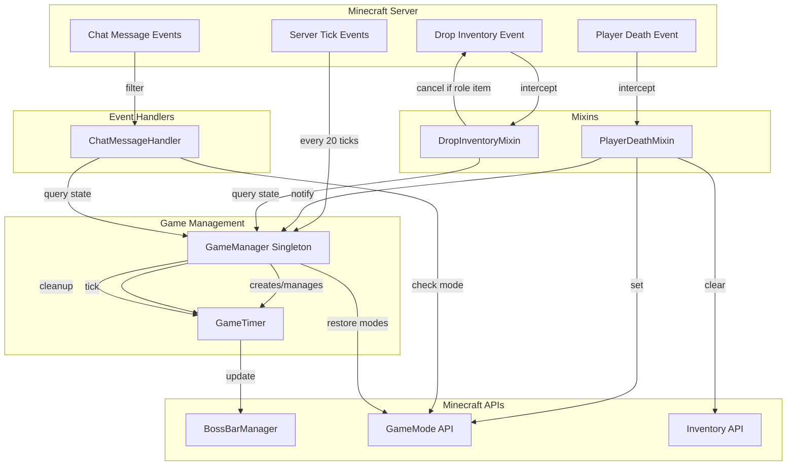

# Design Document: Game Death Mechanics

## Overview

This design implements four interconnected death mechanics for the Murder Mystery Fabric mod: spectator mode transitions, visual game timer, inventory management on death, and chat restrictions for dead players. The design integrates with the existing GameManager singleton and uses Minecraft's mixin system for event interception.

### Key Design Decisions

1. **Spectator Mode Management**: Leverage Minecraft's built-in GameMode.SPECTATOR to allow dead players to observe without interference. GameManager tracks player states and handles mode transitions.

2. **Boss Bar Timer**: Create a dedicated GameTimer class that encapsulates timer logic and boss bar rendering. The timer integrates with Minecraft's server tick cycle (20 ticks/second) for accurate countdown.

3. **Inventory Clearing Strategy**: Use dual mixins - one to clear inventory in onDeath (TAIL injection) and another to prevent role item drops in dropInventory (HEAD injection with cancellation). This ensures role items never appear as world entities.

4. **Chat Event Filtering**: Register a ServerMessageEvents.ALLOW_CHAT_MESSAGE listener that checks player game mode and game state before allowing messages. Dead players (spectators during active game) receive actionbar feedback.

### Integration Points

- **GameManager**: Extended to manage GameTimer lifecycle, spectator mode transitions, and game state queries
- **PlayerDeathMixin**: Enhanced to clear inventory and switch to spectator mode
- **New DropInventoryMixin**: Prevents role items from dropping during active games
- **New ModEvents**: Registers chat message listener during mod initialization
- **New GameTimer**: Standalone class managing boss bar display and countdown logic

## Architecture

### Component Diagram



### Data Flow

**Game Start Flow:**
1. `/mm start` command → GameManager.startGame()
2. GameManager creates GameTimer(server, 300)
3. GameTimer creates boss bar, adds all players
4. GameManager registers tick listener
5. Every 20 ticks: GameManager calls GameTimer.tick()

**Player Death Flow:**
1. Player dies → PlayerDeathMixin.onDeath() (TAIL)
2. Mixin clears player inventory
3. Mixin sets GameMode.SPECTATOR
4. Mixin calls GameManager.onPlayerDeath()
5. GameManager checks win conditions
6. If game ends: GameManager.endGame() → restore all to SURVIVAL

**Item Drop Prevention Flow:**
1. Player dies → Minecraft attempts dropInventory()
2. DropInventoryMixin intercepts (HEAD)
3. Mixin checks: isGameRunning() && hasRoleItem()
4. If true: cancel with ci.cancel()
5. If false: allow normal drop behavior

**Chat Restriction Flow:**
1. Player sends message → ServerMessageEvents.ALLOW_CHAT_MESSAGE
2. Handler checks: isGameRunning() && isSpectator()
3. If dead: send actionbar "Dead players cannot chat", return false
4. If alive or game not running: return true

**Timer Expiration Flow:**
1. GameTimer.tick() returns true when time == 0
2. GameManager detects true return
3. GameManager calls endGame("Time's up! The Murderer wins!")
4. endGame() calls GameTimer.remove() first
5. endGame() restores all players to SURVIVAL

## Components and Interfaces

### GameTimer Class

**Location:** `src/main/java/net/saturn/murdermysteryfabric/game/GameTimer.java`

**Responsibilities:**
- Manage countdown timer state
- Render and update boss bar display
- Format time as M:SS
- Change boss bar color based on remaining time
- Provide player management (add/remove from boss bar)
- Clean up boss bar on game end

**Interface:**
```java
public class GameTimer {
    private final MinecraftServer server;
    private final ServerBossBar bossBar;
    private int remainingSeconds;
    private final int totalSeconds;
    
    // Constructor: creates boss bar, adds all online players
    public GameTimer(MinecraftServer server, int durationSeconds);
    
    // Decrements timer, updates boss bar, returns true if time expired
    public boolean tick();
    
    // Adds a player to the boss bar
    public void addPlayer(ServerPlayerEntity player);
    
    // Removes boss bar from all players and cleans up
    public void remove();
    
    // Helper: formats seconds as M:SS
    private String formatTime(int seconds);
    
    // Helper: updates boss bar text and percent
    private void updateBossBar();
}
```

**Boss Bar Configuration:**
- Identifier: `murdermysteryfabric:game_timer`
- Style: `BossBar.Style.PROGRESS`
- Color: Yellow (≥30s), Red (<30s)
- Overlay: `BossBar.Overlay.PROGRESS`
- Initial text: "Time Remaining: 5:00"

### GameManager Extensions

**New Fields:**
```java
private GameTimer gameTimer;
```

**Modified Methods:**
```java
// Enhanced to create and start GameTimer
public boolean startGame(MinecraftServer server);

// Enhanced to call gameTimer.remove() first, then restore all to SURVIVAL
public void endGame(MinecraftServer server, String reason);

// Enhanced to clear inventory and set spectator mode
public void onPlayerDeath(ServerPlayerEntity killed, MinecraftServer server);

// New: called every 20 ticks to update timer
public void onServerTick(MinecraftServer server);
```

**Tick Registration:**
Register in `startGame()`:
```java
ServerTickEvents.END_SERVER_TICK.register(server -> {
    if (gameRunning && gameTimer != null) {
        if (gameTimer.tick()) {
            endGame(server, "Time's up! The Murderer wins!");
        }
    }
});
```

### PlayerDeathMixin Enhancements

**Location:** `src/main/java/net/saturn/murdermysteryfabric/mixin/PlayerDeathMixin.java`

**Current Implementation:** Calls GameManager.onPlayerDeath()

**Enhanced Implementation:**
```java
@Inject(method = "onDeath", at = @At("TAIL"))
private void onPlayerDeath(DamageSource source, CallbackInfo ci) {
    ServerPlayerEntity player = (ServerPlayerEntity) (Object) this;
    GameManager gm = GameManager.getInstance();
    
    if (gm.isGameRunning()) {
        // Clear inventory to remove role items
        player.getInventory().clear();
        
        // Switch to spectator mode
        player.changeGameMode(GameMode.SPECTATOR);
    }
    
    if (server != null) {
        gm.onPlayerDeath(player, server);
    }
}
```

### DropInventoryMixin (New)

**Location:** `src/main/java/net/saturn/murdermysteryfabric/mixin/DropInventoryMixin.java`

**Purpose:** Prevent role items from dropping when players die during active games

**Implementation:**
```java
@Mixin(ServerPlayerEntity.class)
public class DropInventoryMixin {
    
    @Inject(method = "dropInventory", at = @At("HEAD"), cancellable = true)
    private void preventRoleItemDrop(CallbackInfo ci) {
        ServerPlayerEntity player = (ServerPlayerEntity) (Object) this;
        GameManager gm = GameManager.getInstance();
        
        if (!gm.isGameRunning()) {
            return; // Allow normal drops outside of game
        }
        
        // Check if player has role items
        boolean hasRoleItem = player.getInventory().main.stream()
            .anyMatch(stack -> !stack.isEmpty() && 
                (stack.getItem() == ModItems.KNIFE || 
                 stack.getItem() == ModItems.GUN));
        
        if (hasRoleItem) {
            ci.cancel(); // Prevent dropping
        }
    }
}
```

**Mixin Registration:**
Add to `src/main/resources/murdermysteryfabric.mixins.json`:
```json
{
  "mixins": [
    "PlayerDeathMixin",
    "DropInventoryMixin"
  ]
}
```

### ChatMessageHandler (New)

**Location:** `src/main/java/net/saturn/murdermysteryfabric/event/ModEvents.java`

**Purpose:** Register event listeners for chat filtering

**Implementation:**
```java
public class ModEvents {
    
    public static void register() {
        // Register chat message filter
        ServerMessageEvents.ALLOW_CHAT_MESSAGE.register((message, sender, params) -> {
            GameManager gm = GameManager.getInstance();
            
            // Allow all messages if game is not running
            if (!gm.isGameRunning()) {
                return true;
            }
            
            // Check if sender is in spectator mode (dead player)
            if (sender.interactionManager.getGameMode() == GameMode.SPECTATOR) {
                // Send feedback to dead player
                sender.sendMessage(
                    Text.literal("Dead players cannot chat.")
                        .formatted(Formatting.RED),
                    true // actionbar
                );
                return false; // Block message
            }
            
            return true; // Allow message
        });
    }
}
```

**Registration in Main Class:**
Modify `Murdermysteryfabric.onInitialize()`:
```java
@Override
public void onInitialize() {
    ModItems.initialize();
    ModBlocks.initialize();
    ModItemGroups.initialize();
    ModSounds.initialize();
    ModCommands.register();
    ModEvents.register(); // Add this line
}
```

## Data Models

### GameTimer State

```java
class GameTimer {
    // Immutable configuration
    private final MinecraftServer server;
    private final int totalSeconds;
    private final ServerBossBar bossBar;
    
    // Mutable state
    private int remainingSeconds; // Decrements each tick
    
    // Derived state (computed on demand)
    // - Boss bar percent: (float) remainingSeconds / totalSeconds
    // - Boss bar color: remainingSeconds < 30 ? RED : YELLOW
    // - Formatted time: formatTime(remainingSeconds)
}
```

### GameManager State Extensions

```java
class GameManager {
    // Existing fields
    private boolean gameRunning;
    private Map<UUID, GameRole> playerRoles;
    
    // New field
    private GameTimer gameTimer; // null when game not running
    
    // State invariants:
    // - gameTimer != null IFF gameRunning == true
    // - All spectators during gameRunning are dead players
    // - gameTimer.remove() called before setting gameRunning = false
}
```

### Player State Tracking

**Dead Player Identification:**
- A player is considered "dead" if:
  - `GameManager.isGameRunning() == true` AND
  - `player.interactionManager.getGameMode() == GameMode.SPECTATOR`

**State Transitions:**
```
Game Start:
  All players: SURVIVAL (with roles assigned)

Player Death (during game):
  Inventory cleared → GameMode.SPECTATOR

Game End:
  All players: GameMode.SPECTATOR → GameMode.SURVIVAL
  All inventories: cleared
  gameTimer: removed
```

### Boss Bar Data Model

```java
ServerBossBar {
    identifier: Identifier("murdermysteryfabric:game_timer")
    name: Text (dynamic, updates each tick)
    percent: float (remainingSeconds / totalSeconds)
    color: BossBar.Color (YELLOW or RED)
    style: BossBar.Style.PROGRESS
    overlay: BossBar.Overlay.PROGRESS
    players: Set<ServerPlayerEntity> (all online players)
}
```

## Error Handling

### GameTimer Error Scenarios

**Scenario 1: Server is null during construction**
- **Detection:** Constructor parameter validation
- **Handling:** Throw IllegalArgumentException
- **Recovery:** Caller (GameManager) should not start game

**Scenario 2: Boss bar creation fails**
- **Detection:** getBossBarManager() returns null
- **Handling:** Log error, throw IllegalStateException
- **Recovery:** Game start fails, notify players

**Scenario 3: Timer tick called after removal**
- **Detection:** Check if bossBar is null in tick()
- **Handling:** Return false immediately (no-op)
- **Recovery:** Prevents NPE, game continues normally

**Scenario 4: Player join during active game**
- **Detection:** Player join event while gameRunning == true
- **Handling:** Call gameTimer.addPlayer(player) in join handler
- **Recovery:** New player sees boss bar immediately

### Spectator Mode Error Scenarios

**Scenario 5: changeGameMode fails**
- **Detection:** changeGameMode returns false
- **Handling:** Log warning, continue with game logic
- **Recovery:** Player may remain in survival but inventory is cleared

**Scenario 6: Player dies while game is ending**
- **Detection:** Race condition between death and endGame
- **Handling:** Check gameRunning in both methods
- **Recovery:** If game already ended, skip spectator transition

**Scenario 7: Restoring game mode fails at game end**
- **Detection:** changeGameMode(SURVIVAL) returns false
- **Handling:** Log error for specific player, continue with others
- **Recovery:** Manual admin intervention may be needed

### Inventory Management Error Scenarios

**Scenario 8: Inventory clear fails**
- **Detection:** Exception during clear() call
- **Handling:** Catch exception, log error, continue
- **Recovery:** Some items may remain, but dropInventory mixin prevents role item drops

**Scenario 9: Role item detection fails in mixin**
- **Detection:** NPE when checking item type
- **Handling:** Null checks before item comparison
- **Recovery:** If uncertain, allow drop (safer than blocking legitimate drops)

**Scenario 10: Mixin injection fails**
- **Detection:** Mixin error at mod load time
- **Handling:** Fabric will log error and may disable mod
- **Recovery:** User must fix mixin configuration

### Chat Restriction Error Scenarios

**Scenario 11: Event handler throws exception**
- **Detection:** Try-catch in event handler
- **Handling:** Log error, return true (allow message)
- **Recovery:** Prevents chat system from breaking

**Scenario 12: Actionbar message fails to send**
- **Detection:** sendMessage throws exception
- **Handling:** Catch and log, still return false to block chat
- **Recovery:** Player doesn't see feedback but message is still blocked

**Scenario 13: GameMode check returns null**
- **Detection:** Null check on getGameMode()
- **Handling:** Treat as non-spectator (allow message)
- **Recovery:** Safer to allow than block legitimate messages

### Timer Expiration Error Scenarios

**Scenario 14: endGame called while timer is ticking**
- **Detection:** Check if gameTimer is null before calling remove()
- **Handling:** Null-safe call: `if (gameTimer != null) gameTimer.remove()`
- **Recovery:** Prevents NPE, game ends cleanly

**Scenario 15: Multiple tick events fire simultaneously**
- **Detection:** Synchronization on gameRunning flag
- **Handling:** Use atomic operations or synchronized block
- **Recovery:** Only one endGame call executes

### General Error Handling Patterns

**Defensive Null Checks:**
```java
if (server == null) {
    LOGGER.error("Server is null in GameTimer");
    throw new IllegalArgumentException("Server cannot be null");
}
```

**Graceful Degradation:**
```java
try {
    player.changeGameMode(GameMode.SPECTATOR);
} catch (Exception e) {
    LOGGER.warn("Failed to change game mode for {}", player.getName(), e);
    // Continue with game logic
}
```

**State Validation:**
```java
if (!gameRunning) {
    LOGGER.warn("Attempted to tick timer when game is not running");
    return false;
}
```

## Testing Strategy

This feature involves Minecraft server integration, UI rendering (boss bar), game mode transitions, and event handling. Property-based testing is not appropriate for this type of integration-heavy, side-effect-driven code. Instead, we'll use unit tests for isolated logic and integration tests for Minecraft API interactions.

### Unit Tests

**GameTimer Logic Tests:**
- Test time formatting: formatTime(65) returns "1:05", formatTime(300) returns "5:00"
- Test boss bar percent calculation: 150/300 = 0.5, 30/300 = 0.1
- Test color transitions: ≥30s is yellow, <30s is red
- Test tick countdown: verify remainingSeconds decrements correctly
- Test expiration detection: tick() returns true when time reaches 0

**Role Item Detection Tests:**
- Test hasRoleItem() with KNIFE in inventory returns true
- Test hasRoleItem() with GUN in inventory returns true
- Test hasRoleItem() with regular items returns false
- Test hasRoleItem() with empty inventory returns false

**Dead Player Identification Tests:**
- Test isDeadPlayer() with spectator during game returns true
- Test isDeadPlayer() with survival during game returns false
- Test isDeadPlayer() with spectator outside game returns false

### Integration Tests

**Boss Bar Integration:**
- Create GameTimer with mock server, verify boss bar is created
- Add player to timer, verify player sees boss bar
- Call tick(), verify boss bar text and percent update
- Call remove(), verify boss bar is cleaned up

**Spectator Mode Integration:**
- Simulate player death during game, verify mode changes to SPECTATOR
- Simulate game end, verify all players restored to SURVIVAL
- Test player death outside game, verify mode doesn't change

**Inventory Management Integration:**
- Simulate player death with KNIFE, verify inventory is cleared
- Simulate player death with GUN, verify inventory is cleared
- Verify dropInventory is cancelled when player has role items
- Verify dropInventory proceeds normally outside of game

**Chat Restriction Integration:**
- Send message as spectator during game, verify message is blocked
- Send message as survival during game, verify message is allowed
- Send message as spectator outside game, verify message is allowed
- Verify actionbar feedback is sent to blocked players

**Timer Expiration Integration:**
- Start game with 5-second timer, wait for expiration
- Verify endGame is called with "Time's up!" message
- Verify boss bar is removed before game end logic
- Verify all players restored to survival

### Mock Objects

**MockMinecraftServer:**
- Provides player manager with test players
- Provides boss bar manager for timer tests
- Simulates server tick events

**MockServerPlayerEntity:**
- Simulates inventory operations
- Simulates game mode changes
- Tracks messages sent to player

**MockBossBarManager:**
- Tracks boss bar creation and removal
- Simulates player add/remove operations

### Test Coverage Goals

- **GameTimer class:** 100% line coverage (pure logic, easily testable)
- **GameManager extensions:** 90% line coverage (some error paths hard to trigger)
- **Mixin classes:** 80% line coverage (integration-dependent)
- **Event handlers:** 85% line coverage (event system dependent)

### Manual Testing Checklist

1. Start game with 3+ players, verify boss bar appears
2. Kill a player, verify they enter spectator mode
3. Verify dead player cannot send chat messages
4. Verify dead player sees "Dead players cannot chat" actionbar
5. Wait for timer to expire, verify murderer wins
6. Kill murderer, verify game ends and all players restored
7. Verify no role items drop on ground when players die
8. Join game mid-match, verify boss bar appears for new player
9. Test with 1 player in debug mode, verify timer works
10. End game manually, verify boss bar is removed

### Edge Cases to Test

- Player dies exactly when timer expires (race condition)
- Player disconnects while in spectator mode
- Game ends while player is typing chat message
- Multiple players die simultaneously
- Timer set to 0 seconds (instant expiration)
- Timer set to very large value (overflow check)
- Player has both KNIFE and GUN (shouldn't happen, but test anyway)
- Boss bar with special characters in time display
